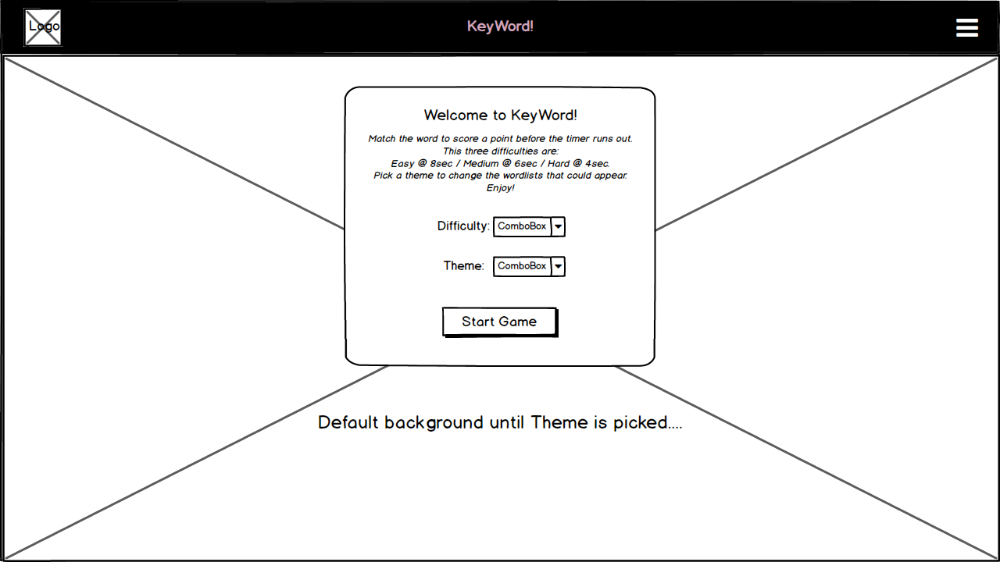
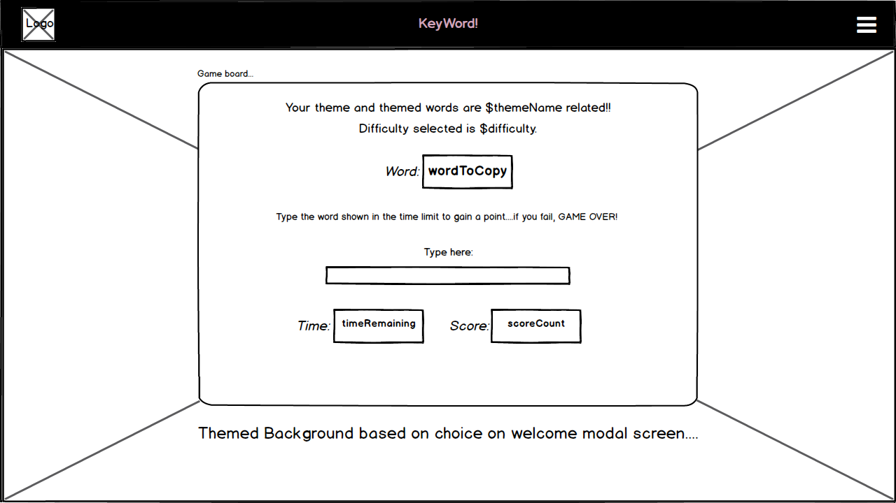
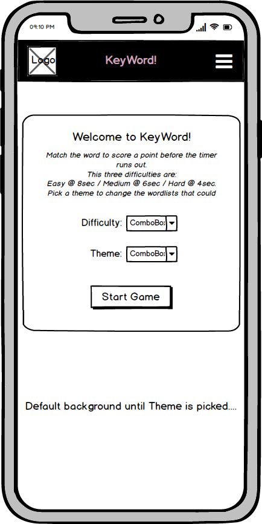
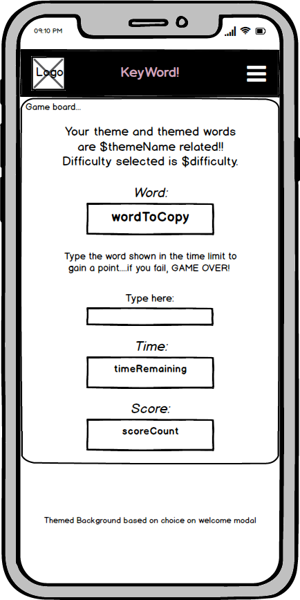

# Milestone Project 2
***

## _KeyWord! the Game_
***

### What does it do and what does it need to fulfill?
This milestone project creation is the culmination of learning and study from the fourth and fifth modules of the Full
Stack Developer Course, Javacript Fundamentals & Interactive Frontend Development, to build a custom mobile-first fully
responsive Vanilla javascript game called "KeyWord!" .

### Functionality of Project.
At its core, this project is built using HTML5, CSS3 and Vanilla Javascript to make the individual features of the game
work. The above three programming languages were used in conjunction with the Bootstrap Framework to ensure the project 
itself is as responsive as possible for use amongst the current everyday screen device sizes such as, Mobile, Tablet and Laptop.

The used throughout the build was imported into the HTML from Google Fonts and is called <a href="https://fonts.googleapis.com/css?family=Bangers&display=swap">'Bangers'</a>,
creating a retro-ish vibe to accompany the overall theme of the Game itself.

This project went outside the original brief as detailed by the course, in the hopes that it would showcase the skills
I have obtained since the last Milestone submission, and is my own custom version of a keyboard typing skills game I
played as a child/young teen, (of which I can only vaguely remember now on our old family HP PC in the early 2000s and
can't remember the name of).

### Technologies & Tools Used.
* HTML ~ main language used to structure the single-page application of the game and the user HUD.
* CSS ~ styling language used to format and visually build upon the accompanying HTML.
* Javasctipt ~ custom vanilla Javascript used to create the game functionality and accompanying game dynamic game elements.
* <a href="https://getbootstrap.com/"> Bootstrap Framework</a> ~ Used as the core structuring layout building blocks of the website, ensuring mobile-frist design and responsive size display.
* Some additional <a href="https://getbootstrap.com/docs/4.3/getting-started/introduction/#js">Imported Javascript & JQuery</a> ~ For the Modal and Responsive Navbar expand & collapse functionality.
* <a href="https://www.jetbrains.com/pycharm/">PyCharm IDE</a> ~ PyCharm was used as the preferred IDE for this project.
* PyCharm built-in Terminal ~ Used to commit to local repository and further push to Github Repo ensuring adequate version
controlling throughout the life-cycle of the project build.
* <a href="https://git-scm.com/">Git</a> ~ Installed on local device and integrated to PyCharm as a Plugin to enable version controlling.
* <a href="https://github.com/auxfuse/Milestone1">Github</a> ~ Used to host the deployed website and repository of all previous versions of the build.
* <a href="https://mycolor.space/">ColorSpace</a> ~ Used to find complimentary color schemes used throughout the game of my primary logo color.
* <a href="http://eye-dropper.kepi.cz/">Eye Dropper (Color Picker)</a> ~ Open Source Google Chrome Extension used to obtain hexadecimal/rgba/hsl values of colours. Built by Kepi (<a href="https://github.com/kepi">Kepi's Github</a>)
* <a href="https://www.pexels.com/">Pexels</a> ~ Online Free stock imagery. Used for providing 4 out of the 5 background images used to match the game's theme.
* <a href="https://tinypng.com/">Tinypng.com</a> ~ Used to compress the background images without affecting image quality/integrity.
* Google Chrome DevTools ~ Used to test the individual custom javascript functions, the responsiveness of the single-page
application, and the CSS visuals, aswell as debugging for errors.
* <a href="https://balsamiq.com/">Balsamiq</a> ~ Used for the creation of my pre-build wireframes showing the main elements and differences in
size of same through small to large screen sizes.
* <a href="https://realfavicongenerator.net/">Favicon Generator</a> ~ Used to create favicon from custom Logo I created for the project.

### Future Features:
* Add additional Themes, Theme backgrounds and lists for the user to choose from on Game start Menu.
* Add 'High Score' Feature to store the best scores to local storage for the User to try and beat.
* Create an 'Infinite & Un-Timed' Mode for the User to just Learn to type at their own pace.

### Deployment.
This single-page application Game was developed in PyCharm IDE and version controlling was utilised via local (git) and online (github) repository
technologies. 
 
Deploying this single-page application Game was acheived through Github pages by:
* Selecting the Repository from my list in the Github Dashboard.
* Navigating to <i>"Settings"</i> and to the <i>"Github Pages"</i> section.
* From the <i>"Source"</i> section, click on the dropdown and select the the "Master Branch" from the associated list.
* Once <i>"Master Branch"</i> is selected, the page will auto-refresh and navigate the user to the top of the page with a
visual ribbon display detailing <i>"Github pages source saved</i>, indicating the success of the deployement.
* The link to the website can then be found under the <i>"Github Pages"</i> section, with a ribbon notification stating:<br> __"Your site is published at "https://auxfuse.github.io/Milestone2/index.html".__

To clone the website:
* Select the Repository from the Github Dashboard.
* Click on the <i>"Clone or download"</i> green button located above and to the right of the File Structure table.
* Click on the <i>"clipboard icon"</i> to the right of the Git URL to copy the web URL of the Clone. 
* Open your preferred Integrated Development Environment (IDE) and navigate to the terminal window.
* Change the directory to where you want to clone the repository too. (In the case of PyCharm the directory path can be found through the <i>"Navigate"</i> tab).
* Paste the Git URL copied from above and click <i>"Ok"</i>. (Again in the case of PyCharm once you click <i>"clone"</i>, Git Root mapping will be automatically set to the project Root directory).

---
---

## User Experience

### User Stories

-Generic User (gamer):
* As a user, I want a game to help my typing skills get faster.
* As a user, I want something fun to challenge my typing skills.
* As a user, I want a mobile friendly game to play whilst on the go via my mobile phone/tablet.
* As a user, I want a game that will help my children learn to type.
* As a user, I want a fun game for my kids to help with their spelling.

For a generic user, the game assists in fulfilling these goals by:
* Creating clean, aesthetically pleasing visuals.
* Allowing the user to dynamically set the words via Theme and the difficulty to set the timer on the "Main menu".
* Setting the core design process of the application to be Fully Responsive via Bootstrap Mobile First approach.
* Enticing themes such as popular current media trends in Pokemon & Superheroes for Children and then engaging the more mature audience with Beaches & Crossft.
* Allowing a parent to have a game on their devices that is child-friendly and will assist in cognitive learning abilities such as increasing hand-eye coordination and enhancing grammar and linguistics skills.

-Developer:
* As a developer, I want to create a pure Javascript game to test my skills to date.
* As a developer, I want to create fully responsive app to showcase my skills to a potential employer.
* As a developer, I want an on-going project I can enhance and improve over time as my skills grow.
* As a developer, I wanted to create a game as Gaming has been my primary hobby since being a child.

For myself as the developer, the game build assisted in fulfilling these goals by:
* Enabling me to develop the logic and learn the structure of object-oriented programming.
* Allowing me to go outside of the current brief of the milestone to create an application from Vanilla Javascript.
* Assisting me in using additional resources such as Mozilla MDN docs and Udemy courses to learn the more about Vanilla Javascript.
* Preparing myself the world of Object-Orientated Languages.

---

### Design

In general the design of the game is pretty straight forward, a Single-Page application with elements that seamlessly interact via events. The project
utilises a single index.html file in conjunction with the Bootstrap Framework to ensure Mobile first fully responsive design. When considering design elements
for this project, a retro-ish vibe for the typography and color scheme came to mind. 

1. Font:

    The project has a main font of <a href="https://fonts.google.com/specimen/Bangers">'Bangers'</a> which was imported via the head element of the html file from Google Fonts, 
with the backup font being set to a default of 'Sans-serif'. The straight forward captalised style of 'Bangers' made it easily recognisable for each character of the alphabet
to ensure a user could read each and every letter/number/special character shown.

2. Color Scheme:
    
    Two primary conflicting colors were conceived when creating this project:
    *  `#44ff78` - Primary color
    *  `#00dde2` - Secondary color
    *  `#000000` - Tertiary color
    
    The primary color was used as the dominant color in the logo and to draw the attention to interactive elements in the Main menu and to the focus elements
    such as the "shown word" or the "remaining time" to the user on the gameboard. The secondary color was used as a continuous palette choice of the basic accompanying
    text to the Primary color justification. The Main menu modal, the Gameboard and the Game over modal all utilise the tertiary color as a solid contrast to the neon
    overarching illumination of the primary and secondary colors.
    
    The default background of the game in general is a two-tone gradient dark on top fading out to the secondary color. 
    
    `background: linear-gradient(to bottom, #000000 0%, #000000 21%, #00dde2 100%);` 3-stops were used in the two-tone gradient to allow the bleed-out of the darker of the two colors to happen at a
    predetermined point specified by myself @21% of the height of the total viewport height. 
    
3. Logo:

    The logo was custom created by myself as a play on the game name of "KeyWord!". The plain vector of the key image with the cut-out "word" offset with transparency made for a slightly mechanically
    whimsical and fun feature to distinguish the game from a host of similar games in the real world marketplace. The logo was made in Microsoft Excel by importing a basic key vector and then overlaying
    shapes onto the vector in the Primary color. From their I used a textbox from Microsoft Excel with some basic font to create the "Word" in the Tertiary color and overlay onto the traced vector
    image. Finally the shapes and text were grouped together to flatten into one layer and then exported as a .png file to use within the project.
    
    This .png file was passed through TinyPNG.com resulting in the smallest possible size whilst maintaining the current high-res image and the original aspect ratio. The newly compressed .png file of
    the logo was saved into an "img" folder within the "assets" folder of the Project Directory where it can be accessed and utilised as part of the project.
    <h1 align="center">
        
    </h1>
    
4. Geometry: 

    The prominent geometry of the game is square with rounded edges which are conceivable with the color scheme and the typography of the primary font. Each section of the game, whether that be
    Main Menu Modal, the Gameboard or the Game Over Modal are square with black backgrounds, and a primary color assigned to the borders to offset them against the gradient of the body.
    By using a common 2D shape for the main elements and components of the Game, it ensure a very easy solution and accompanying methodology approach to Mobile first design.
    
5. Wireframing:

    Wireframes for this project were created using Balsamiq, for Small and Large viewports to show the difference between them detailing how the elements would react to
    the size differences. Each element was structurally planned out at this stage and even during the physical build of the application there wasn't much deviation from the original
    planning.
    * Large device Wireframe for the Main menu Modal:
    
    <h1 align="center">
        
    </h1>
    
    * Large device Wireframe for the Gameboard:
    
    <h1 align="center">
        
    </h1>
    
    * Mobile device Wireframe for the Main menu Modal:
    
    <h1 align="center">
        
    </h1>
    
    * Mobile device Wireframe for the Gameboard:
    
    <h1 align="center">
        
    </h1>
        
### Features

This project incorporates the Bootstrap Framework and DoM manipulation to present and feature the main elements of the application being the "Main-Menu Modal", the "Gameboard" and the "Game-Over Modal". The project's logical flow of elements is as follows:

1. The applications header has two small functions that act rather similarly to each other. Although similar to each other, I decided to keep them both in at their current functionality as they both use different methods to apply the same effects on the application.
   * The logo is placed in the top-left position of the SPA as is customary with current branding conventions. The logo itself is wrapped in an anchor tag referenced to this page itself, thus acting as a <i>refresh</i>.
   * The <i>"Settings"</i> navigation link is to act as a computed refresh to call upon the main-menu to allow the user to change Theme or Difficulty mid-game reseting the timer and current score. This is achievable through a custom function which uses a built in method of the browser WebAPI to reload the current session from the browser rather than the cache:<br>
```
// Replay game function to refresh browser window.
function replayGame() {

    // Use of "window.location" to get the current URL and reloading to same via "reload(true)" to reload from browser instead of the cache.
    window.location.reload(true);
}
```

2. On page load, a modal pops up acting as the "main-menu" for the user, asking them to pick a difficulty and a theme and explaining the rules surrounding the concept of their selection and the impact they have on the game. The user cannot start the game without selecting a Difficulty and a Theme, and if they try to do so a Browser Alert, which is a built in method of the browser WebAPI, will alert them of their intention to do so directing them back to the Main-Menu for selection.

3. The Gameboard features a host of dynamically updated fields and an input field that the User can type into in an attempt to match the shown word:
   * A "theme-span" Span element targetted via Javascript with the value of the Theme selection passed into to show the user there current Themed selection.
   * A "diff-span" Span element targetted via Javascript with the value of the Difficulty selection passed into to show the user there current Difficulty selection.
   * A "shown-word" Span element targetted via Javascript to show the user the currently generated Random word from the `setWord` method built in the "game" object, for them to attempt to match. Another Span element preceeds the "shown-word" element to act as a Pseudo-label to detail some direction to the User that this is the <i>"Word to Match"</i>.
   * A "time-span" Span element detailing to the user the remaining time in seconds the user has to make a successful match the Game is over. As with the "shown-word" element, another Span element preceed the "time-span" element to act as a Pseudo-label to direct the user attention to the decrementing Time, <i>"Time to beat"</i>.
   * The user input element is nested within a div and is part of the Bootstrap Frameworks "from-group" class of elements. It is a basic "input" form element set to accept "text" meaning alpha-numerical characters can be accepted along with special characters such as "/". "-" which may pop up in some of the Randomly generated words, as input elements have no automatic validation associated with them.<br>The user may input their proposed match into the input field as either Uppercase or Lowercase without causing detrimental affects to the outcome via checking the input versus the shown random word and then passing both values through the `toLowerCase()` built in JS function ensuring a case match. Doing this we are keeping the core methodology of the game intact in that we are checking for spelling only! 
   * A small tooltip under the input field with a simple direction to <i>"Match the word shown in the given time....or GAME OVER!!"<i> for the user.
   * A "score-span" Span element targetted via Javascript detailing the total score of the current game session. Again as before a Pseudo-label preceeds this dynamic element detailing, <i>"Total Score:"</i>
 
4. Once the timer reaches zero, the game is instantly ended, and the user is presented with the "Game-over" modal which details several components relating to the game and the game build:
   * The "Gameboard" display attribute is set to none to remove it from the DOM so the user is only displayed the Game over screen.
   * The current score at the time of losing is shown to the user via targetting a span element via `querySelector` and setting it equal to the `game.score` value. 
   * Some accompanying text thanking the user for playing and offering them the chance to provide feedback is supplied.
   * A Bootstrap Framework inline list class was used on an un-ordered list to set the social icons in a horizontally aligned format. The iconography used for these links were obtained via FontAwesome and then styled via custom CSS. On hover, each social icon will rotate 360deg clockwise to add an animated feel to a mainly static display for the user. They also convert from the secondary color to the primary color to visualise the animation and draw the eye of the user. Each link will open in a new tab ensuring the user does not fully navigate away from the application and promoting user retention to return.
   * A single button <i>"Replay"</i> is present to allow the user to return to the main-menu and restart the game with new preferences in Theme and Difficulty if they so wish. This function is achieved via an event listener linked to the "onclick" porperty of the Replay button that invokes the `replayGame()` function. 
