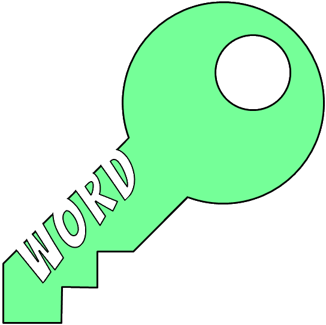

# Milestone Project 2
***

## _KeyWord! the Game_
***

### What does it do and what does it need to fulfill?
This milestone project creation is the culmination of learning and study from the fourth and fifth modules of the Full
Stack Developer Course, Javacript Fundamentals & Interactive Frontend Development, to build a custom mobile-first fully
responsive Vanilla javascript game called "KeyWord!" .

### Functionality of Project.
At its core, this project is built using HTML5, CSS3 and Vanilla Javascript to make the individual features of the game
work. The above three programming languages were used in conjunction with the Bootstrap Framework to ensure the project 
itself is as responsive as possible for use amongst the current everyday screen device sizes such as, Mobile, Tablet and Laptop.

The used throughout the build was imported into the HTML from Google Fonts and is called <a href="https://fonts.googleapis.com/css?family=Bangers&display=swap">'Bangers'</a>,
creating a retro-ish vibe to accompany the overall theme of the Game itself.

This project went outside the original brief as detailed by the course, in the hopes that it would showcase the skills
I have obtained since the last Milestone submission, and is my own custom version of a keyboard typing skills game I
played as a child/young teen, (of which I can only vaguely remember now on our old family HP PC in the early 2000s and
can't remember the name of).

### Technologies Used.
* HTML ~ main language used to structure the single-page application of the game and the user HUD.
* CSS ~ styling language used to format and visually build upon the accompanying HTML.
* Javasctipt ~ custom vanilla Javascript used to create the game functionality and accompanying game dynamic game elements.
* <a href="https://getbootstrap.com/"> Bootstrap Framework</a> ~ Used as the core structuring layout building blocks of the website, ensuring mobile-frist design and responsive size display.
* Some additional <a href="https://getbootstrap.com/docs/4.3/getting-started/introduction/#js">Imported Javascript & JQuery</a> ~ For the Modal and Responsive Navbar expand & collapse functionality.
* <a href="https://www.jetbrains.com/pycharm/">PyCharm IDE</a> ~ PyCharm was used as the preferred IDE for this project.
* PyCharm built-in Terminal ~ Used to commit to local repository and further push to Github Repo ensuring adequate version
controlling throughout the life-cycle of the project build.
* <a href="https://git-scm.com/">Git</a> ~ Installed on local device and integrated to PyCharm as a Plugin to enable version controlling.
* <a href="https://github.com/auxfuse/Milestone1">Github</a> ~ Used to host the deployed website and repository of all previous versions of the build.
* <a href="https://mycolor.space/">ColorSpace</a> ~ Used to find complimentary color schemes used throughout the game of my primary logo color.
* <a href="http://eye-dropper.kepi.cz/">Eye Dropper (Color Picker)</a> ~ Open Source Google Chrome Extension used to obtain hexadecimal/rgba/hsl values of colours. Built by Kepi (<a href="https://github.com/kepi">Kepi's Github</a>)
* <a href="https://www.pexels.com/">Pexels</a> ~ Online Free stock imagery. Used for providing 4 out of the 5 background images used to match the game's theme.
* <a href="https://tinypng.com/">Tinypng.com</a> ~ Used to compress the background images without affecting image quality/integrity.
* Google Chrome DevTools ~ Used to test the individual custom javascript functions, the responsiveness of the single-page
application, and the CSS visuals, aswell as debugging for errors.
* <a href="https://balsamiq.com/">Balsamiq</a> ~ Used for the creation of my pre-build wireframes showing the main elements and differences in
size of same through small to large screen sizes.
* <a href="https://realfavicongenerator.net/">Favicon Generator</a> ~ Used to create favicon from custom Logo I created for the project.

### Future Features:
* Add additional Themes, Theme backgrounds and lists for the user to choose from on Game start Menu.
* Add 'High Score' Feature to store the best scores to local storage for the User to try and beat.
* Create an 'Infinite & Un-Timed' Mode for the User to just Learn to type at their own pace.

### Deployment.
This single-page application Game was developed in PyCharm IDE and version controlling was utilised via local (git) and online (github) repository
technologies. 
 
Deploying this single-page application Game was acheived through Github pages by:
* Selecting the Repository from my list in the Github Dashboard.
* Navigating to <i>"Settings"</i> and to the <i>"Github Pages"</i> section.
* From the <i>"Source"</i> section, click on the dropdown and select the the "Master Branch" from the associated list.
* Once <i>"Master Branch"</i> is selected, the page will auto-refresh and navigate the user to the top of the page with a
visual ribbon display detailing <i>"Github pages source saved</i>, indicating the success of the deployement.
* The link to the website can then be found under the <i>"Github Pages"</i> section, with a ribbon notification stating:  __"Your site is published at "https://auxfuse.github.io/Milestone2/index.html".__

To clone the website:
* Select the Repository from the Github Dashboard.
* Click on the <i>"Clone or download"</i> green button located above and to the right of the File Structure table.
* Click on the <i>"clipboard icon"</i> to the right of the Git URL to copy the web URL of the Clone. 
* Open your preferred Integrated Development Environment (IDE) and navigate to the terminal window.
* Change the directory to where you want to clone the repository too. (In the case of PyCharm the directory path can be found through the <i>"Navigate"</i> tab).
* Paste the Git URL copied from above and click <i>"Ok"</i>. (Again in the case of PyCharm once you click <i>"clone"</i>, Git Root mapping will be automatically set to the project Root directory).

### User Stories

-Generic User (gamer):
* As a user, I want a game to help my typing skills get faster.
* As a user, I want something fun to challenge my typing skills.
* As a user, I want a mobile friendly game to play whilst on the go via my mobile phone/tablet.
* As a user, I want a game that will help my children learn to type.
* As a user, I want a fun game for my kids to help with their spelling.

For a generic user, the game assists in fulfilling these goals by:
* Creating clean, aesthetically pleasing visuals.
* Allowing the user to dynamically set the words via Theme and the difficulty to set the timer on the "Main menu".
* Setting the core design process of the application to be Fully Responsive via Bootstrap Mobile First approach.
* Enticing themes such as popular current media trends in Pokemon & Superheroes for Children and then engaging the more mature audience with Beaches & Crossft.
* Allowing a parent to have a game on their devices that is child-friendly and will assist in cognitive learning abilities such as increasing hand-eye coordination and enhancing grammar and linguistics skills.

---

-Developer:
* As a developer, I want to create a pure Javascript game to test my skills to date.
* As a developer, I want to create fully responsive app to showcase my skills to a potential employer.
* As a developer, I want an on-going project I can enhance and improve over time as my skills grow.

For myself as the developer, the game build assisted in fulfilling these goals by:
* Enabling me to develop the logic and learn the structure of object-oriented programming.
* Allowing me to go outside of the current brief of the milestone to create an application from Vanilla Javascript.
* Assisting me in using additional resources such as Mozilla MDN docs and Udemy courses to learn the more about Vanilla Javascript.
* Preparing myself the world of Object-Orientated Languages.

### User Experience

### Features

